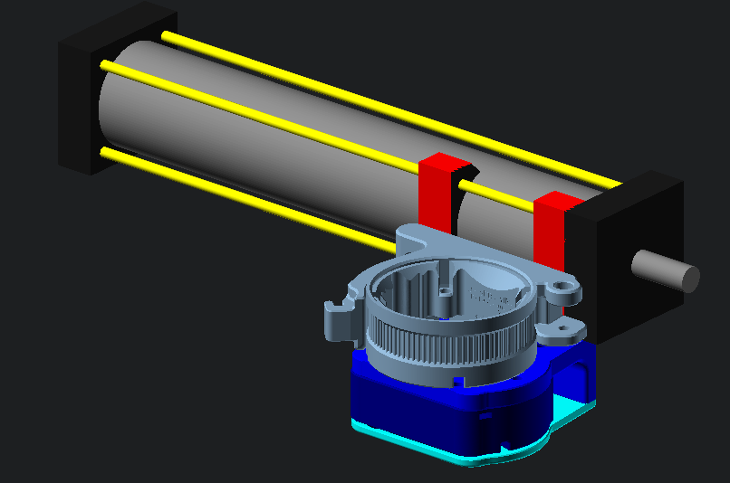
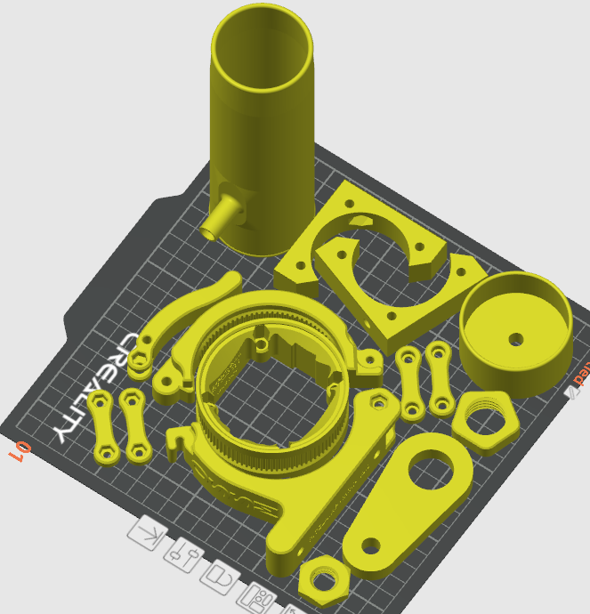
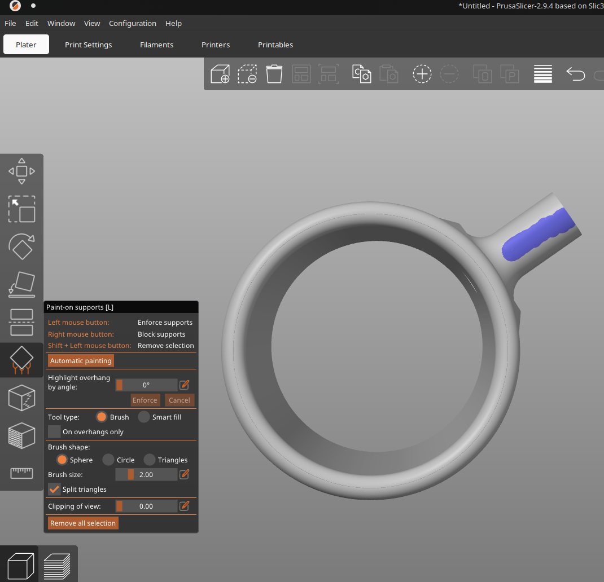
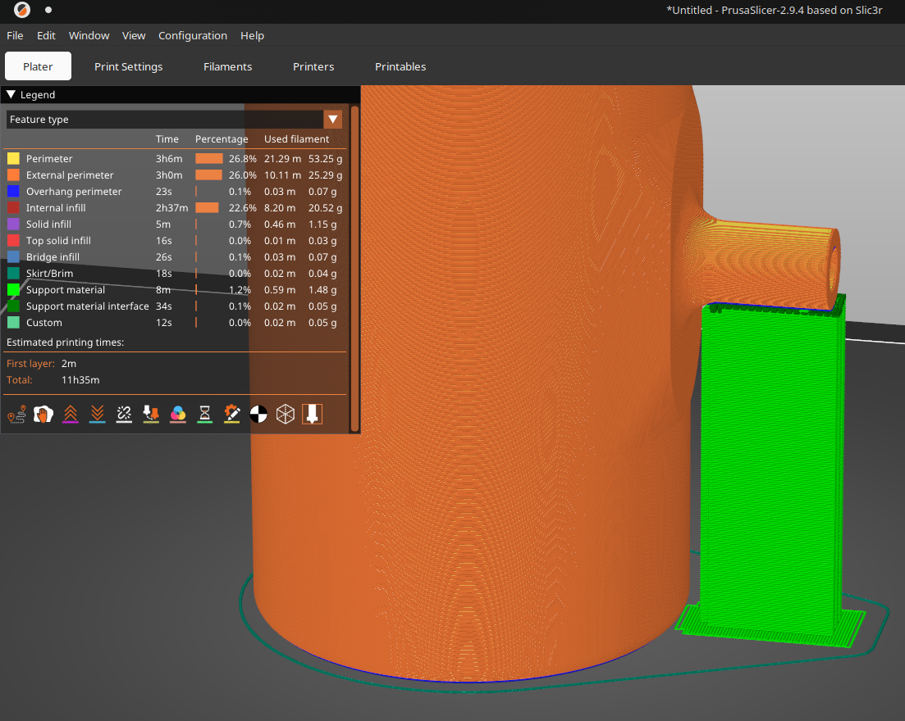

# OSSM Job 
#### This is a drop-in attachment to quickly and reversibly convert your OSSM to a piston driven pneumatic stroker device

## Overview
The piston attaches to the OSSM faceplate with [3d printed clamps](STL/OSSM-Job-Piston-Clamps.stl) and screws. A 3d printed [linkage](STL/OSSM-Job-Arm-Linkage.stl) attaches the piston arm to the OSSM arm...now the piston goes back and forth.  The 3d printed [air adaptor](STL/OSSM-Job-Piston-Hose-Adaptor.stl) screws into the piston and the hose is stuck on top of it.  

The other end of the hose attaches to [the receiver](STL/OSSM-Job-Receiver-M.stl).  You could use a receiver from any name brand stroker...otherwise, files are included to [make your own](STL/OSSM-Job-Receiver-M.stl)!  A sheath is stretched inside the receiver and folded over the outside of each end to keep in place.  The cap is put on the far end and a one-way valve attached to [the cap](STL/OSSM-Job-Receiver-cap.stl).  Add some carrots and you've got a stew baby!
<p align="center">
    
</p>

## Customization
- This is designed to be open source to not need a commercial CAD program.  It uses OpenSCAD which uses code for cad.  This workflow is not for everybody, but it does maximize shareability and file simplicity. (But fillets are a bitch).
- To make customizations you will need to [download OpenSCAD](https://openscad.org) and also [install the BOSL2 library](https://github.com/BelfrySCAD/BOSL2?tab=readme-ov-file#installation)
- You may find a dedicated code editor like VS Code more convenient for scad files


## 3d printed parts:
- [top](STL/OSSM-Job-Piston-Clamps.stl) and bottom clamps for securing the piston (4 pieces total)
- [linkage](STL/OSSM-Job-Arm-Linkage.stl) for the toy end of the arm.
- [air adaptor](STL/OSSM-Job-Piston-Hose-Adaptor.stl) for connecting piston to hose
#### optional:
- [receiver](STL/OSSM-Job-Receiver-M.stl) and [cap](STL/OSSM-Job-Receiver-cap.stl)
- [autoblow type receiver with a wider bottom](STL/OSSM-Job-Receiver-M-flared.stl) and [cap](STL/OSSM-Job-Receiver-cap-flared.stl)



## BOM
You will need to buy some parts for this to work, most importantly a piston:

- [Piston from amazon for $34](https://www.amazon.com/HNJPC-Aluminum-Pneumatic-Cylinder-SC63X150/dp/B0BZYHXKFH )
- Nuts & Bolts:
    - 2 M3x35 screws to join the top side of the clamps
    - 2 M3 nuts for the above top side screws
    - 2 M3x15 screws to attach the bottom to the OSSM faceplate
    - 2 M4x80 screws to join the bottom side of the clamps (unless you do the through-hole mod to your OSSM)
    - 2 M4 nuts for the above screws 
    - **optional:** 2 M3x50 screws and nuts to use with the through-hole customization to the OSSM (This makes the M4 screws redundant)
- a pre-built receiver setup like [The Autoblow Vacuglide](https://autoblow.com/product/vacuglide-large-accessories-pack/)
#### or use the included 3d printed receiver with:
- Receiver sleeves (also a few options here):
    - [Autoblow sleeves for \$20: ](https://autoblow.com/product/vacuglide-power-pulse-sleeve/ )
    - [Serious Kit transparent liners for £12.75: ](https://www.seriouskit.com/products/see-through-liners?variant=47351005774123 )
    - [a bicycle tube for \$7](https://www.amazon.com/Standard-Bicycle-Inner-Presta-Valve/dp/B007SNUJEY)
    - [This goat milker might work for \$13!](https://www.amazon.com/Oumefar-Milking-Machine-Replacement-Accessories/dp/B09M36F82R)
- Check valves from \$5 - \$15 (there are a few options though you might need to adjust the diameter of the stem to fit some kinds):
    - [Original autoblow duckbill valve the receiver design is based on](https://autoblow.com/product/vacuglide-nipples-2-set/ )
    - [cheapo amazon duckbill valve](https://www.amazon.com/Compatible-Replacement-Accessories-Signature-Smartpump/dp/B0CP16F4VF)
    - [push-to-fit check valve](https://www.amazon.com/Bwintech-Straight-Pneumatic-Connect-Compressor/dp/B0CFTZZ8B2  )
- a flexible hose with in inner diameter of 10mm (or 3/8" in freedom units).  
    - [latex hose from amazon for $8](https://www.amazon.com/Feelers-Natural-Speargun-Slingshot-Catapult/dp/B093WBLZMP)

## Demonstration video

<video controls width="100%"> <!-- Sadly this html only works on github pages, not github.com proper -->
  <source src="https://rubberyfun.github.io/OSSM-Job/assets/inaction.mp4" type="video/mp4" controls>
  Your browser does not support the video tag.
</video> 

[Link to the demonstration video](https://rubberyfun.github.io/OSSM-Job/assets/inaction.mp4)

## Quirks
- For more stability you can customize your OSSM with through bolts in the head unit by either taking a drill to your current part, or [printing this modified OSSM Actuator with the through holes](STL/OSSM%20-%20Actuator%20-%20Body%20-%20Bottom%20-%20through-holes.stl).
- You're going to want to keep the depth centered in the OSSM range so it doesn't bottom out.  There is a "stroker mode" setting at the bottom of [OSSM-Possum](https://github.com/RubberyFun/OSSM-Possum) that will do this for you automatically.
- If the piston arm is moved to either extreme before the OSSM is turned on it may be under extra tension and convince the OSSM it's stuck.  It's best to start the arm in the middle of the stroke when powering on the OSSM.
- It doesn't matter which end of the piston you screw the hose adaptor to.  It operates much quieter if you remove any other adapter from the other port so it has as much airflow as possible.
- If you prefer a wider entrance like the Autoblow or will be using those liners use the STLs ending in "-flared".  Or to make your own STL set ```receiver_base_flare``` at the top of [scad/receiver.scad](scad/receiver.scad) to 10 (which signifies a 10mm wider diameter at the base)
- you will need supports for the hose valve stem.  I prefer using PrusaSlicer to paint on those supports as pictured rather than enabling suports for the whole model because it tends to rough up the bottom of the receiver.




## Thoughts about the receiver
It's kinda silly, perhaps risky, to 3d print the receiver but I included it to leave the option open because gatekeeping snobs suck.  It has worked fine and been sturdy enough so far but you should probably consider getting a moulded plastic receiver that is traditionally manufactured with injection molding. Similarly you could get some 2" PVC, add a 3/8" valve to one side, and it'll work with minor adjustments to the cap. 

I'm calling this out because a 3d printed receiver may not stand up to the abuse of a play session: the vacuum could overwhelm it catastrophically or more subtly crack and lose pressure, the stem could break off.  But if you understand all that and still wanna give it a try have fun!

## Related
- For a dedicated piston driven stroker [check out Diglet48's project](https://github.com/diglet48/toy-designs/tree/main/SC63%20pneumatic%20stroker) that inspired this one.  It's a much sturdier belt design.
- Want to control it wirelessly?  Check out the companion app [OSSM-Possum](https://github.com/RubberyFun/OSSM-Possum) featured in the above video.
- Obviously you should know about the engine that drives this contraption [the OSSM](https://github.com/KinkyMakers/OSSM-hardware)

## Fine print

I made this for people to enjoy...no strings attached, no cost, no in-app advertising.  [The code is open-source, posted on Github](https://github.com/RubberyFun/OSSM-Job).

[OSSM Job](https://github.com/RubberyFun/OSSM-Job) © 2026 by [Claus Macher](https://rubberyfun.com) is licensed under [CC BY-SA 4.0](https://creativecommons.org/licenses/by-sa/4.0/).  It basically means you can do whatever you want with the code but anything you make with it should include an attribution and keep the same license.  Yes, that means you can make money off your remix but don't just copy the code and call it a day.

This is not directly affiliated with Kinky Makers or their products in any way...I just think they're OSSM.
