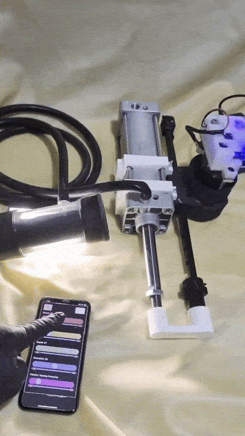
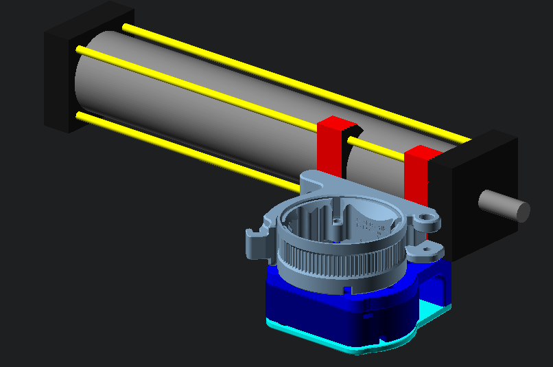
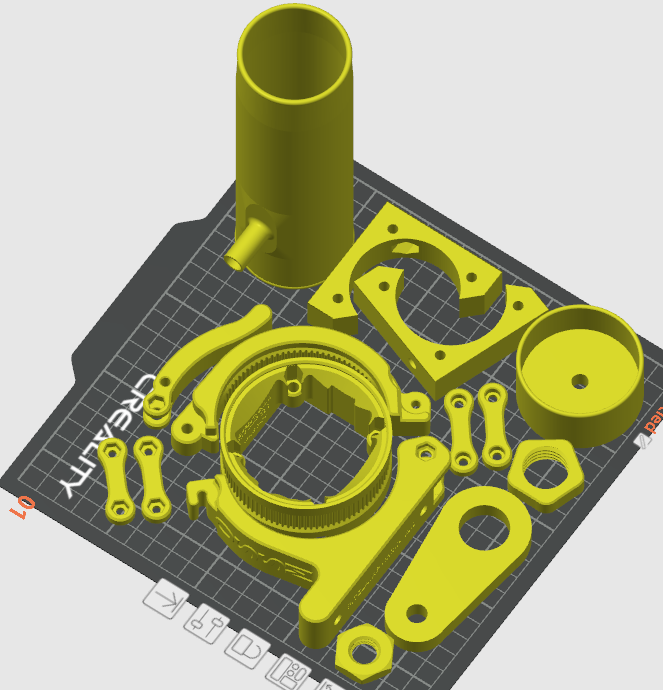
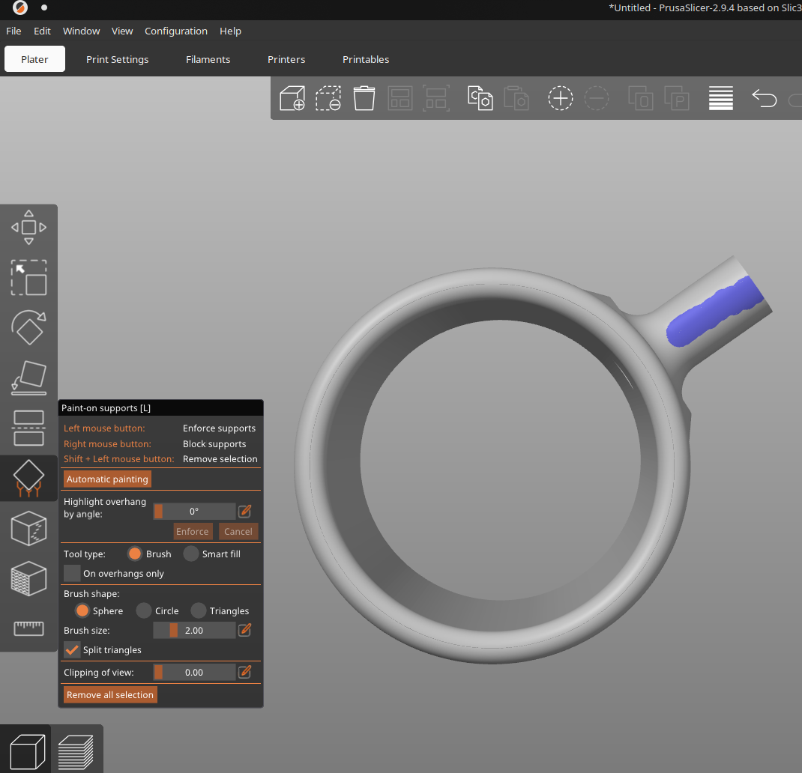
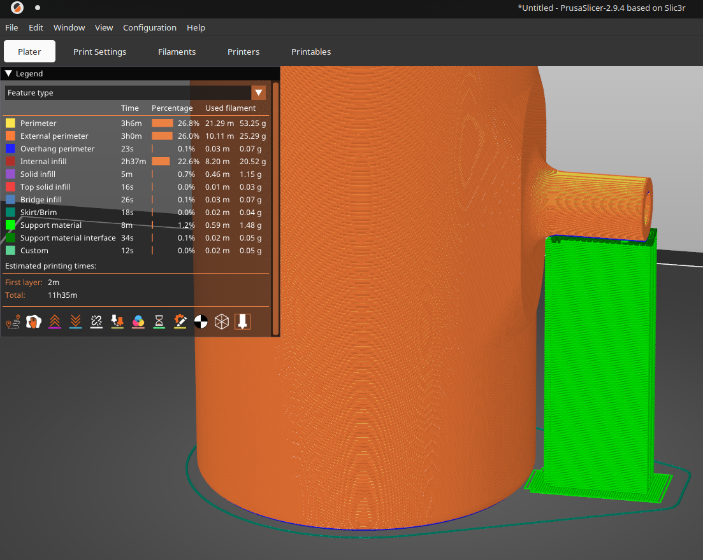

# OSSM Job 
#### This is a drop-in attachment to quickly and reversibly convert your OSSM to a piston driven pneumatic stroker device
<p align="center">
    
</p>

## Overview
The piston attaches to the OSSM faceplate with [3d printed clamps](STL/OSSM-Job-Piston-Clamps.stl) and screws. A 3d printed [linkage](STL/OSSM-Job-Arm-Linkage.stl) attaches the piston arm to the OSSM arm...now the piston goes back and forth.  The 3d printed [air adaptor](STL/OSSM-Job-Piston-Hose-Adaptor.stl) screws into the piston and the hose is stuck on top of it.  

The other end of the hose attaches to [the receiver](STL/OSSM-Job-Receiver-M.stl).  You could use a receiver from any name brand stroker...otherwise, files are included to [make your own](STL/OSSM-Job-Receiver-M.stl)!  A sheath is stretched inside the receiver and folded over the outside of each end to keep in place.  The cap is put on the far end and a one-way valve attached to [the cap](STL/OSSM-Job-Receiver-cap.stl).  Add some carrots and you've got a stew baby!



## 3d printed parts:
- [top](STL/OSSM-Job-Piston-Clamps-SC50.stl) and bottom clamps for securing the piston (4 pieces total)
- [linkage](STL/OSSM-Job-Arm-Linkage-SC50.stl) for the toy end of the arm.
- [air adaptor](STL/OSSM-Job-Piston-Hose-Adaptor-SC50.stl) for connecting piston to hose
- [pitclamp mini](https://github.com/KinkyMakers/OSSM-hardware/blob/main/Documentation/ossm/Hardware/standard-printed-parts/pitclamp) for quick transfer of the OSSM motor
#### optional:
- [receiver](STL/OSSM-Job-Receiver-M.stl) and [cap](STL/OSSM-Job-Receiver-cap.stl)
- alternative [autoblow type receiver with a wider bottom](STL/OSSM-Job-Receiver-M-flared.stl) and [cap](STL/OSSM-Job-Receiver-cap-flared.stl)



## BOM
In addition to the printed parts above you will need to buy some parts for this to work, most importantly a piston:

- [SC50-200 Piston like this one from amazon for $35](https://www.amazon.com/HNJPC-Cylinder-Pneumatic-Industrial-Automation/dp/B0BZCL5859)
- Nuts & Bolts: ([for the pitclamp](https://github.com/KinkyMakers/OSSM-hardware/blob/main/Documentation/ossm/Hardware/standard-printed-parts/pitclamp))
    - 2 M6x15 screws to join the clamps to the mount (M5 would work)
    - 2 M6 nuts for the above screws (M5 would work)
    - 1 M5x20 Socket Cap Head Bolt for hinge
    - 1 M5 Hex Nut for hinge
    - 2 M4x25 Socket Cap Head Bolts for latch
    - 1 M4x12 or M4x10 Socket Cap Head Bolt for handle
    - 3 M4 Hex Nuts for latch and handle
&nbsp;
- Optional: a pre-built receiver setup like 
    - [The original Venus 200 receiver for $39](https://venusformen.com/shop/receiver/)
    - [The Autoblow Vacuglide for $69](https://autoblow.com/product/vacuglide-large-accessories-pack/)
    - [A SeriousKit receiver could be converted for £150](https://www.seriouskit.com/collections/spts/products/see-through-lined-spt)
#### ...or use the included 3d printed receiver with:
- Receiver sleeves (also a few options here):
    - [Original venus sleeves for about \$5 each](https://venusformen.com/shop/liner-material/)
    - [Autoblow sleeves for \$20](https://autoblow.com/product/vacuglide-power-pulse-sleeve/ )
    - [Serious Kit transparent liners for £12.75: ](https://www.seriouskit.com/products/see-through-liners?variant=47351005774123 )
    - [Buy a bit of latex \$12](https://mjtrends.com) and make your own! \$12 is enough for 24 sheaths but requires latex crafting skills.
    - [A latex 34-42 bicycle tube for \$19](https://us.challengetires.com/products/latex-inner-tube) Only the bigger sizes will work.  The jury is out whether this is worth it...standard butyl tires are cheap but thick, TPU isn't stretchy enough, and latex tubes are rare in big enough sizes.  Anybody know where to buy thin latex tubing at 1.5" / 40mm diameter?
- Check valves from \$5 - \$15 (there are a few options though you might need to adjust the diameter of the stem to fit some kinds):
    - [Original autoblow duckbill valve the receiver design is based on](https://autoblow.com/product/vacuglide-nipples-2-set/ )
    - [cheapo amazon duckbill valve](https://www.amazon.com/Compatible-Replacement-Accessories-Signature-Smartpump/dp/B0CP16F4VF)
    - [push-to-fit check valve](https://www.amazon.com/Bwintech-Straight-Pneumatic-Connect-Compressor/dp/B0CFTZZ8B2  )
- a flexible hose with in inner diameter of 10mm (or 3/8" in freedom units).  
    - [silicone tube from amazon for \$14](https://www.amazon.com/dp/B0CYSX8HB9) or [latex hose from amazon for $8](https://www.amazon.com/Feelers-Natural-Speargun-Slingshot-Catapult/dp/B093WBLZMP)

## Demonstration video

<video controls width="100%"> <!-- Sadly this html only works on github pages, not github.com proper -->
  <source src="https://rubberyfun.github.io/OSSM-Job/assets/inaction.mp4" type="video/mp4" controls>
  Your browser does not support the video tag.
</video> 

[Link to the demonstration video](https://rubberyfun.github.io/OSSM-Job/assets/inaction.mp4)

## The devil is in here:
- You will probably want to add another [Pitclamp Mini](https://github.com/KinkyMakers/OSSM-hardware/tree/main/Documentation/ossm/Hardware/standard-printed-parts/pitclamp) to your OSSM so it can be quickly converted from its regular setup to a stroker.  It's a common upgrade, endorsed by Research + Desire.
- You're going to want to keep the depth centered in the OSSM range so it doesn't bottom out.  There is a "stroker mode" setting in [OSSM-Possum](https://github.com/RubberyFun/OSSM-Possum) that will do this for you automatically.
- You may hear a clicking sound from your OSSM motor.  This is likely the belt slipping.  The piston has the potential to need higher torque than the OSSM is designed for and you may need to tighten your belt.
- If the piston arm is moved to either extreme before the OSSM is turned on it may be under extra tension and convince the OSSM it's stuck.  It's best to start the arm in the middle of the stroke when powering on the OSSM.
- It doesn't matter which end of the piston you screw the hose adaptor to.  It operates much quieter if you remove any other adapter from the other port so it has as much airflow as possible.
- You will probably want to add a check valve / one-way valve to the pressure tube to allow air to escape.  A dedicated device to keep receiver pressure consistent is in the works.
- If you prefer a wider entrance like the Autoblow or will be using those liners: use the STLs ending in "-flared".  Or to make your own STL: set ```receiver_base_flare``` at the top of [scad/receiver.scad](scad/receiver.scad) to 10 (which signifies a 10mm wider diameter at the base)
- you will need supports for the hose valve stem. Automatic might work for you if you keep them from roughing up the front of the receiver, otherwise try painting them on




## Customization
- This is designed to be open source and not need a commercial CAD program.  It uses OpenSCAD which uses code for cad.  This workflow is not for everybody, but it does maximize shareability and file simplicity. (But fillets are a bitch).
- To make customizations you will need to [download OpenSCAD](https://openscad.org) and also [install the BOSL2 library](https://github.com/BelfrySCAD/BOSL2?tab=readme-ov-file#installation)
- You may find a dedicated code editor like [VS Code](https://code.visualstudio.com/) more convenient for scad files

## Related
- For a dedicated piston driven stroker [check out Diglet48's project](https://github.com/diglet48/toy-designs/tree/main/SC63%20pneumatic%20stroker) that inspired this one.  It's a much sturdier belt design.
- Credit goes to Frayd for the V2 concept using a Pitclamp and the support bars of the cylinder.  It is a much more efficient setup than V1.
- Want to control it wirelessly?  Check out the companion app featured in the above video [OSSM-Possum.
](https://github.com/RubberyFun/OSSM-Possum)
- Want to use it hands free?  [Check out the OSSMount!
](https://github.com/RubberyFun/OSSMount)
- Obviously you should know about the engine that drives this contraption [the OSSM](https://github.com/KinkyMakers/OSSM-hardware)

## Fine print

I made this for people to enjoy...no strings attached, no cost, no in-app advertising.  [The code is open-source, posted on Github](https://github.com/RubberyFun/OSSM-Job).

[OSSM Job](https://github.com/RubberyFun/OSSM-Job) © 2026 by [Claus Macher](https://rubberyfun.com) is licensed under [CC BY-SA 4.0](https://creativecommons.org/licenses/by-sa/4.0/).  It basically means you can do whatever you want with the code but anything you make with it should include an attribution and keep the same license.  Yes, that means you can make money off your remix but don't just copy the code and call it a day.

This is not directly affiliated with Kinky Makers or their products in any way...I just think they're OSSM.
